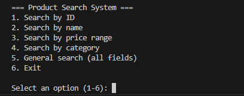
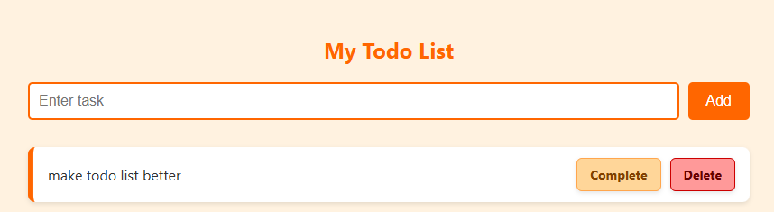

# Node.js Learning Playground

This project is a personal Node.js learning environment. Each file or folder demonstrates a specific concept or library. It's a hands-on way for me to practice and understand how Node.js works, both on its own and with popular packages.

---

## 📁 Project Overview

### 🐮 cowsay.js
Demonstrates using the `cowsay` package to output fun text in the terminal.

### 📖 readline.js
Uses the `readline` package to take command-line input and output results.

### 🌐 read.js
A basic HTTP server that responds with one of two HTML pages based on the requested URL.

---

## 🛢️ Database-Related

### 🔌 connection.js & `.env`
Handles connection to a MySQL database using credentials stored in environment variables.

### 🛠️ table_creation.js
Creates a `products` table and inserts random data — used to test database search queries.

### 🔍 search.js

A command-line tool that searches the `products` table based on user input.

---

## 🔗 API & HTTP Practice

### 🌐 request.js
Simple example using the `axios` package to fetch data from a public API.

### 📁 first_api/
A small server project that responds with either AQI data or static files based on the request URL.

---

## 🗃️ MongoDB Practice

### 🧪 mongoconnection.js & mongo.js
Practice connecting to and using MongoDB with Node.js.

---

## 📤 File Upload

### uploadfile.js
A basic file upload form using Node.js and the `formidable` package — saves uploaded files to disk.

---

## 🚀 Web Development with Express

### express/
Starting to learn and build small applications using the Express framework.

---

## 🔐 Authentication Practice

### signup.js
A simple signup form that collects a username, email, and password, and saves it to a MySQL database.

---

---

## 📋 Todo List App (MySQL + Node.js)

A simple, full-stack todo list built using plain Node.js, MySQL, and basic HTML — no frameworks or libraries.

### ✨ Features
- Add tasks using an input form
- View current todos
- Mark tasks as completed
- Delete tasks
- Server built using native `http` module
- Database interaction via MySQL (no ORM)

### 📁 Files
- `server.js`: Main application logic
- `connection.js`: MySQL connection module

> This is a great project to bring together everything learned about HTTP handling, routing, forms, databases, and dynamic HTML rendering.

---

## 📌 Notes

This project is mainly for practice and experimentation. Code may be simple, unoptimized, or incomplete — and that's okay! It's all part of the learning process.

---

## 🧠 Goals

- Learn core Node.js modules (`http`, `fs`, `path`, etc.)
- Practice using third-party packages (`axios`, `formidable`, `express`, `readline`, `cowsay`, etc.)
- Work with both MySQL and MongoDB
- Build basic servers and work with form data, file uploads, and APIs

---

## 💬 Author

This is a personal learning project created by someone diving into backend development with Node.js.
